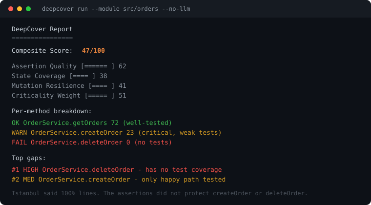

# DeepCover

[](https://www.npmjs.com/package/@anatolykhelmer/deep-cover)
[](https://github.com/anatolykhelmer/deepcover/actions/workflows/ci.yml)
[](https://www.npmjs.com/package/@anatolykhelmer/deep-cover)
[](LICENSE)
[](https://www.npmjs.com/package/@anatolykhelmer/deep-cover)

Line coverage tells you **what ran**. DeepCover tells you **what's actually protected**.

An agentic coverage analyzer for TypeScript projects tested with Jest or Vitest. Deterministic AST analysis plus bounded LLM reasoning (or your coding agent — no API key) produce a meaningful-coverage score: would these tests catch a real regression, or did they just execute a line?

## Why Istanbul is not enough

100% line coverage does not mean the tests are good:

```typescript
it('should create order', async () => {
  const result = await service.createOrder(mockInput);
  expect(result).toBeDefined(); // 100% line coverage, near-useless assertion
});
```

Istanbul reports full coverage for `createOrder`. That test still passes if the method returns `null`, `{}`, or the wrong order.

| Question | Jest / Istanbul | DeepCover |
|----------|:---:|:---:|
| Was this line executed? | Yes | — |
| Was this branch hit? | Yes | — |
| Is the assertion meaningful? | — | Yes |
| Are all domain states tested? | — | Yes |
| Would tests catch a mutation? | — | Yes |
| Which untested code is riskiest? | — | Yes |
| What's mocked vs. real? | — | Yes |
| Dependency / transitive coverage? | — | Yes |

Istanbul also cannot tell a *decisive* operand from one that was merely *evaluated*. A guard like `if (a || b || c)` can show full branch coverage when every test enters through `a`. DeepCover splits the chain and flags the operands you could delete with the suite still green.

DeepCover does not replace Istanbul — it **merges** with it. When both are available, Istanbul answers "did this run?" and DeepCover answers "is it protected?"

## Report



```
DeepCover Report
════════════════
Composite Score: 47/100

  Assertion Quality   ██████░░░░  62
  State Coverage      ████░░░░░░  38
  Mutation Resilience ████░░░░░░  41
  Criticality Weight  █████░░░░░  51

Per-method breakdown:
  ✅ OrderService.getOrders      72  (well-tested)
  ⚠️  OrderService.createOrder    23  (critical, weak tests)
  ❌ OrderService.deleteOrder      0  (no tests)

Top gaps:
  #1 HIGH  OrderService.deleteOrder — "has no test coverage"
  #2 MED   OrderService.createOrder — "only happy path tested"
```

With the [test-runner reporter](#test-runner-integration) and `--coverage`, the same report is grounded in real line/branch hits instead of static heuristics.

## Quick start

**Prerequisites:** Node.js >= 18, a TypeScript project tested with Jest or Vitest. The Vitest reporter needs Node >= 20 (Vitest 4's own floor). Jest-only projects stay on Node >= 18.

No API key:

```bash
npx @anatolykhelmer/deep-cover run --root . --module src/your-module --no-llm
```

CI gating — fail if the score is below the threshold:

```bash
npx @anatolykhelmer/deep-cover run --root . --module src/your-module \
  --no-llm --format score --min-score 60
```

**Recommended:** use your coding agent as the Reasoner, then merge with runtime coverage.

```bash
npm install -g @anatolykhelmer/deep-cover
deepcover init --agent cursor    # or: --agent claude
```

In Cursor Agent or Claude Code:

> run deepcover on src/your-module

Then [wire the reporter](#test-runner-integration) and run tests with `--coverage` before analyzing. Scores get sharply more accurate; without those artifacts, scoring falls back to static heuristics.

DeepCover runs as three stages, always in this order, always through files in `<root>/.deepcover/`:

| Stage | Command | Writes | LLM? |
|---|---|---|---|
| 1 | `deepcover extract --module <path>` | `code-model.json`, `prompts.json` | no |
| 2 | `deepcover reason` | `reasoner-output.json` | yes — or a template for your agent |
| 3 | `deepcover analyze` | nothing (prints the report) | no |

`deepcover run` performs all three in one command. Stage 2 is the only stage that involves an LLM, and it always says which Reasoner it used.

Walkthroughs: [Cursor](#install-for-cursor-recommended) · [Claude Code](#install-for-claude-code) · [Anthropic API](#install-for-anthropic) · [CLI](#cli) · [Scoring](#scoring-model) · [Configuration](#configuration) · [Test-runner integration](#test-runner-integration)

## Architecture

Four-phase pipeline:

```
                                    ┌─────────────────────┐
                                    │      npm test       │
                                    │    (Jest/Vitest)    │
                                    └────────┬────────────┘
                                             │
                              ┌──────────────┼──────────────┐
                              ▼              ▼              ▼
                     runtime.json       istanbul-coverage  coverage-final
                     (pass/fail/dur)    .json (Vitest only)  (runner default)
                              │              │
Source + Tests ──► [Extractor] ──► CodeModel  │
                    (ts-morph)        │       │
                                     ▼       ▼
                               [Coverage Resolver]
                                     │
                                     ▼
                              ResolvedCoverage
                                     │
                    ┌────────────────┼────────────────┐
                    ▼                                  ▼
              [Reasoner]                          [Scorer]
              (LLM/Cursor)                      (4 sub-scores)
                    │                                  ▼
                    └──────────────────────────► ScoreResult
```

- **Extractor** — Deterministic AST analysis: classes, methods, branches, dependencies, assertions, mocks
- **Coverage Resolver** — Merges static AST analysis with Jest/Vitest runtime and Istanbul coverage data into unified, class-qualified coverage
- **Reasoner** — LLM semantic analysis with enriched prompts: domain states, assertion quality, criticality, transitive coverage
- **Scorer** — Deterministic formula: 4 sub-scores, 3 of them with LLM influence capped by `reasoner.maxInfluence` (default ±20 points)

What DeepCover adds on top of line coverage:

- **Assertion strength** — `toBeDefined()` is weak, `toEqual(expected)` is strong, `toHaveBeenCalledWith(...)` verifies interactions.
- **Branch semantics** — a hit branch is classified as a guard, error path, or retry condition, and the exact expressions go to the Reasoner.
- **Compound conditions** — `if (a || b)` is four things to test, not one. The `untested-condition-operand` detector flags operands no test ever drives.
- **Domain states** — business scenarios, error conditions, and edge cases from branch conditions and test names.
- **Dependency graph** — Controller → Service → Gateway is traced as a path. Istanbul treats each file in isolation.
- **Criticality ranking** — a public method with high complexity and external calls outranks a getter.
- **Mock analysis** — detects tests that mock away the thing they claim to test.

## Install for Cursor (recommended)

DeepCover uses the Cursor agent as the Reasoner — no API key. The npm package and the Cursor skill are separate: installing the CLI does not install the skill.

### 1. Install the CLI

```bash
npm install -g @anatolykhelmer/deep-cover
```

Or without a global install:

```bash
npx @anatolykhelmer/deep-cover --help
```

### 2. Install the Cursor skill (once)

```bash
deepcover init --agent cursor
# same as: deepcover init
# → ~/.cursor/skills/deepcover/SKILL.md
```

Share with the team (commit the skill into the repo):

```bash
deepcover init --agent cursor --project
# → ./.cursor/skills/deepcover/SKILL.md
```

| | Personal (`deepcover init`) | Project (`--project`) |
|---|---|---|
| Where | `~/.cursor/skills/deepcover/` | `./.cursor/skills/deepcover/` |
| Scope | All your projects | This repo only |
| Share | No | Yes — commit and push |

### 3. Run in Cursor Agent

Open the project in Cursor → **Agent** chat (not Ask) → ask:

> run deepcover on src/your-module

The skill runs the equivalent of:

```bash
npx deepcover extract --root <PROJECT_ROOT> --module <MODULE_PATH> --bugs
# agent fills .deepcover/reasoner-output.json
npx deepcover analyze --root <PROJECT_ROOT> --bugs
```

You do not need to fill JSON by hand — the agent does that step for you.

**Check it worked:** after `deepcover init`, the skill file above should exist. If the agent ignores the skill, start a new Agent chat or reload Cursor so skills are picked up.

## Install for Claude Code

Same skill workflow as Cursor — Claude Code is the Reasoner (uses your Claude Code / Anthropic subscription). No separate `ANTHROPIC_API_KEY` for the agent path; do not set `reasoner.provider: 'anthropic'` unless you want the CLI to call the API itself.

### 1. Install the CLI

```bash
npm install -g @anatolykhelmer/deep-cover
```

### 2. Install the Claude Code skill (once)

```bash
deepcover init --agent claude
# → ~/.claude/skills/deepcover/SKILL.md
```

Share with the team:

```bash
deepcover init --agent claude --project
# → ./.claude/skills/deepcover/SKILL.md
```

| | Personal | Project (`--project`) |
|---|---|---|
| Where | `~/.claude/skills/deepcover/` | `./.claude/skills/deepcover/` |
| Scope | All your projects | This repo only |
| Share | No | Yes — commit and push |

### 3. Run in Claude Code

In a Claude Code session on the project, ask:

> run deepcover on src/your-module

The skill runs the equivalent of:

```bash
npx deepcover extract --root <PROJECT_ROOT> --module <MODULE_PATH> --bugs
# agent fills .deepcover/reasoner-output.json
npx deepcover analyze --root <PROJECT_ROOT> --bugs
```

**Check it worked:** the skill file above should exist. If Claude ignores it, restart Claude Code or run `/reload-skills`.

## Install for Anthropic

Use this when you want the CLI to call Anthropic directly (CI, headless, no Cursor/Claude Code agent). No agent skill needed.

### 1. Install the peer dependency

In the project you analyze (or globally alongside the CLI):

```bash
npm install @anthropic-ai/sdk
```

Without the SDK, DeepCover prints a clear install error instead of failing at import time.

### 2. Set the API key

DeepCover reads `ANTHROPIC_API_KEY` from the environment (or `reasoner.apiKey` in config). It does **not** auto-load a `.env` file.

```bash
export ANTHROPIC_API_KEY=sk-ant-...
```

### 3. Point config at Anthropic

Create or edit `deepcover.config.ts` in the project root:

```typescript
export default {
  reasoner: {
    provider: 'anthropic',
    model: 'claude-sonnet-4-20250514', // optional — this is the default
    // apiKey: process.env.ANTHROPIC_API_KEY, // optional if the env var is set
  },
};
```

### 4. Run (do not pass `--no-llm`)

```bash
npx deepcover run --root <PROJECT_ROOT> --module <MODULE_PATH> --bugs
```

`run` performs extract → reason (Anthropic Messages API) → analyze in one command.

| | Cursor / Claude Code | Anthropic API |
|---|---|---|
| Skill / Agent | yes (`init --agent …`) | no |
| API key | not needed for agent path | `ANTHROPIC_API_KEY` |
| How to run | Agent: «run deepcover…» | `run` in the terminal |
| `--no-llm` | skips LLM | skips LLM (no API calls) |

## CLI

### `deepcover run`

One-shot: extract, reason, and analyze in sequence. Equivalent to running the three stages below back to back.

| Flag | Description | Default |
|------|-------------|---------|
| `--root <path>` | Project root directory | Current directory |
| `--module <path>` | Module to analyze (relative to root) | — |
| `--file <path>` | Single file to analyze | — |
| `--output <dir>` | Artifact directory | `.deepcover` |
| `--no-llm` | Skip the reason stage (deterministic only) | false |
| `--format <fmt>` | Output: `terminal`, `json`, or `score` | `terminal` |
| `--min-score <n>` | Exit `1` if the composite score is below this | `thresholds.composite` |
| `--bug-threshold <n>` | Exit `1` if high-risk bugs >= n (requires `--bugs`) | — |
| `--bugs` | Enable bug analysis across all three stages | off |

### `deepcover extract`

Extract the CodeModel and LLM prompts for Cursor-driven analysis.

| Flag | Description | Default |
|------|-------------|---------|
| `--root <path>` | Project root directory | Current directory |
| `--module <path>` | Module to analyze (relative to root) | — |
| `--file <path>` | Single file to analyze | — |
| `--output <dir>` | Artifact directory — see the note below | `<root>/.deepcover` |
| `--bugs` | Include 5th bug-finding prompt + write deterministic `bug-signals.json` | off |

**`--output` is for tooling that reads the artifacts itself.** `analyze` and
`score` always read `<root>/.deepcover` and have no counterpart flag, so
artifacts written elsewhere cannot be scored by DeepCover. (`reason` can be
pointed at a relocated model with `--code-model`, but it still writes and reads
the rest of `<root>/.deepcover`.) Omit `--output` for the normal
`extract → reason → analyze` flow.

Produces:
- `code-model.json` — structured code model (classes, methods, branches, tests)
- `prompts.json` — LLM prompts for the Cursor agent (4, or 5 with `--bugs`)
- `reasoner-output.json` — empty template for the agent to fill
- `bug-signals.json` — *(with `--bugs`)* deterministic bug detector signals

### `deepcover reason`

Run the LLM Reasoner via the configured provider and write `reasoner-output.json` (no scoring).

| Flag | Description | Default |
|------|-------------|---------|
| `--root <path>` | Project root directory | Current directory |
| `--module <path>` | Module to analyze (relative to root) | — |
| `--file <path>` | Single file to analyze | — |
| `--code-model <file>` | Existing CodeModel JSON (skips extract) | — |
| `--output <file>` | Output path | `<root>/.deepcover/reasoner-output.json` |
| `--bugs` | Include bug-finding (`bugFindings`) | off |

Staged CI example:

```bash
npx @anatolykhelmer/deep-cover extract --module src/orders
npx @anatolykhelmer/deep-cover reason  --module src/orders --bugs
npx @anatolykhelmer/deep-cover score   --min-score 60 --bugs
```

`--code-model .deepcover/code-model.json` can replace `--module` on `reason` if `extract` already ran.

### `deepcover analyze`

Score the artifacts already on disk in `.deepcover/` and produce a report. Does not extract
or call an LLM — run `extract` (and `reason`, or fill `reasoner-output.json` yourself) first,
or use `deepcover run` for one-shot.

| Flag | Description | Default |
|------|-------------|---------|
| `--root <path>` | Project root directory | Current directory |
| `--format <fmt>` | Output: `terminal`, `json`, or `score` | `terminal` |
| `--min-score <n>` | Exit `1` if the composite score is below this | `thresholds.composite` |
| `--bugs` | Enable bug-finding (detectors + optional reasoner bugs) | off |
| `--bug-threshold <n>` | Exit `1` if high-risk bugs >= n (requires `--bugs`) | — |

### `deepcover score`

Output only the composite score — alias for `analyze --format score`. Exits with code 1 if
below threshold. Same requirement as `analyze`: it reads artifacts already in `.deepcover/`.

| Flag | Description | Default |
|------|-------------|---------|
| `--root <path>` | Project root directory | Current directory |
| `--min-score <n>` | Minimum passing score (0-100) | `thresholds.composite` |
| `--bugs` | Enable bug-finding analysis | off |
| `--bug-threshold <n>` | Exit `1` if high-risk bugs >= n (requires `--bugs`) | — |

### `deepcover init`

Install the agent skill (Cursor or Claude Code) so the agent can run extract → reason → analyze.

| Flag | Description | Default |
|------|-------------|---------|
| `--agent <name>` | Target agent: `cursor` or `claude` | `cursor` |
| `--project` | Install into `./.<agent>/skills/deepcover/` (commit and share) | off |

```bash
deepcover init --agent cursor              # ~/.cursor/skills/deepcover/
deepcover init --agent cursor --project    # ./.cursor/skills/deepcover/
deepcover init --agent claude              # ~/.claude/skills/deepcover/
deepcover init --agent claude --project    # ./.claude/skills/deepcover/
```

Walkthroughs: [Install for Cursor](#install-for-cursor-recommended) · [Install for Claude Code](#install-for-claude-code).

## Scoring Model

Four sub-scores combined with configurable weights:

| Sub-score | Weight | What it measures |
|-----------|--------|-----------------|
| Assertion Quality | 30% | Are assertions meaningful? (strong > medium > weak matchers, relative to method complexity) |
| State Coverage | 30% | Are all meaningful domain states tested? (purely reasoner-driven — business scenarios, error conditions, edge cases) |
| Mutation Resilience | 25% | Would tests catch subtle code changes? (branch coverage + assertion specificity) |
| Criticality Weighting | 15% | Is the important code tested? (blast radius + business criticality) |

The LLM's adjustment to each sub-score is capped by `reasoner.maxInfluence`
(default `0.2`, i.e. ±20 points) and scaled by its confidence — except state
coverage, which the LLM never adjusts directly; its number comes from
resolver-confirmed states, not a confidence-weighted nudge. Assertion quality
and criticality weighting are, by how their formulas average per-judgment
contributions, naturally bounded well inside that cap in practice; only
mutation resilience routinely reaches it. See
[Configuration](#configuration) for the exact bound on each. Without LLM
(`--no-llm`), you get the deterministic base scores only.

**Smart weight redistribution:** When a sub-score doesn't apply (e.g. state coverage when the Reasoner has no discovered states), its weight is redistributed proportionally to the applicable sub-scores.

**Per-method composite** uses three factors: Istanbul line coverage baseline (up to 30 pts), state score (up to 35 pts), and assertion score (up to 35 pts). Methods with 100% Istanbul line coverage get the full baseline even without direct test assertions.

**Per-method domain states** come from two sources, unioned and deduplicated by state description:

- the **static extractor**, which derives states from enums, union types and parameter guards and attaches them to every method they affect. A static state counts as tested when any method it affects is covered.
- the **Reasoner**, whose `discoveredStates` are keyed by class and method. A reasoner state counts as tested when the Reasoner marked it tested *and* the resolver confirms the method is genuinely covered — a state inside a method no test reaches cannot have been exercised, whatever the model says.

Most services have no type-level states at all, so without the reasoner join a method's state score is 0 and its composite cannot exceed 65 no matter how well tested it is.

**Matcher strength** is one shared taxonomy (`src/scorer/matchers.ts`) used by every sub-score and by the per-method rollup:

| Strength | Matchers | Why |
|----------|----------|-----|
| Strong | `toEqual`, `toStrictEqual`, `toBe`, `toMatchObject`, `toBeCloseTo`, `toThrow`, `toHaveBeenCalledWith`, `toHaveBeenLastCalledWith` | Pins a concrete expected value or call shape |
| Medium | `toContain`, `toMatch`, `toHaveLength`, `toHaveBeenCalledTimes` | Pins a property of the value |
| Weak | `toBeDefined`, `toBeTruthy`, `toBeFalsy`, `toBeNull` | Pins only that something was produced |

The `resolves`, `rejects` and `not` modifiers are unwrapped, so `await expect(p).resolves.toEqual(x)` classifies as `toEqual`.

**Transitive assertion credit:** When an assertion targets a method call (e.g. `expect(user.getName()).toBe('Alice')`), the `getName` method gets credit even though the test targets `createUser`. This properly reflects how service-level tests transitively verify data-class methods.

## Configuration

Create `deepcover.config.ts` in your project root:

```typescript
export default {
  // Which files to analyse. Omit to use the defaults shown.
  include: ['**/*.ts'],
  exclude: ['**/*.spec.ts', '**/*.test.ts', '**/node_modules/**'],
  testPattern: ['**/*.spec.ts', '**/*.test.ts'],

  reasoner: {
    provider: 'cursor',       // 'cursor' | 'anthropic' | 'mock' | 'none'
    // model: 'claude-sonnet-4-20250514',  // when provider is anthropic
    // apiKey: process.env.ANTHROPIC_API_KEY,
    maxInfluence: 0.2,        // caps how far the reasoner can move a score (see below)
  },
  weights: {
    assertionQuality: 0.30,
    stateCoverage: 0.30,
    mutationResilience: 0.25,
    criticalityWeighting: 0.15,
  },
  thresholds: {
    composite: 60,
  },
};
```

Also supports `.js` and `.json` config files.

`include`, `exclude`, and `testPattern` are glob arrays deciding which files the
extractor reads and which of them count as tests. Each replaces its default
wholesale rather than extending it — narrowing `include` means narrowing it. A
`--module` or `--file` flag overrides `include` for that invocation, the same
flag-beats-config precedence the score threshold uses.

`thresholds.composite` sets the project's default pass mark: `analyze`, `score`,
and `run` exit `1` when the composite falls below it. A `--min-score` flag on the
command line overrides it for that invocation. With neither set, no gate applies.

`reasoner.maxInfluence` caps how far the reasoner may move **assertion quality**,
**mutation resilience**, and **criticality weighting** — each sub-score's LLM
adjustment is clamped to ±`maxInfluence` × 100 points. In practice that clamp is
the binding constraint only for mutation resilience: its adjustment scales with
the number of LLM-confirmed transitive coverage inferences and is one-sided (the
reasoner can only raise it), so enough confirmations reach the cap at any
configured value, including the default. Assertion quality and criticality
weighting are each a mean of per-judgment contributions, which is
mathematically bounded before any clamp runs — assertion quality within
roughly ±10 points, criticality weighting asymmetrically within roughly
-10 to +2 points (a confirmed-high-and-untested rating pulls it down by up
to 10; a confirmed-low-and-covered rating pulls it up by at most 2). Their
default ±20-point cap (`maxInfluence: 0.2`) is never actually reached
either way — `maxInfluence` only visibly constrains assertion quality's or
criticality's downward moves once configured below roughly 0.1, and
criticality's upward moves below roughly 0.02. It does **not** govern state
coverage, which the LLM cannot move directly at all: when Istanbul branch
data is available, that score is capped at overall Istanbul branch coverage
+ 10 points, tying LLM-discovered states to runtime evidence rather than to
a configurable budget; without Istanbul data, no such cap applies.

The four `weights` must sum to `1`. They are spent directly in the composite
score, so any other total pushes results off the 0–100 scale. Because the
defaults already sum to 1, overriding one weight means restating all four.

The config is validated when it loads, and an invalid config stops the run with
exit code 1 before any work happens. Unknown keys are errors — if DeepCover
rejects a key you expect to work, check it against the fields above. Deleting
the config file runs on the defaults shown here.

**Anthropic:** set `reasoner.provider` to `'anthropic'` and provide a key. Full walkthrough: [Install for Anthropic](#install-for-anthropic).

## Using with Cursor

Setup: [Install for Cursor](#install-for-cursor-recommended) (Claude Code: [Install for Claude Code](#install-for-claude-code)). After that, in the agent say **"run deepcover on my webhooks module"** — the skill handles the rest.

### How it works

```
┌─────────────┐     ┌──────────────┐     ┌─────────────┐
│  CLI extract │────▶│ Cursor Agent │────▶│ CLI analyze  │
│  (Phase 1)   │     │  (Phase 2)   │     │  (Phase 3)   │
│  CodeModel   │     │  Reasoning   │     │  Final Score │
└─────────────┘     └──────────────┘     └─────────────┘
```

1. **Extract** — CLI runs AST analysis, outputs CodeModel + prompts to `.deepcover/`
2. **Reason** — Cursor agent reads the CodeModel, performs semantic analysis (domain states, assertion quality, criticality, transitive coverage), writes `reasoner-output.json`
3. **Score** — CLI combines deterministic metrics with agent insights, produces the final report

### Manual pipeline (without the skill)

```bash
# Step 1: Extract
npx @anatolykhelmer/deep-cover extract \
  --root . --module src/webhooks

# Step 2: Cursor agent fills .deepcover/reasoner-output.json

# Step 3: Score with insights
npx @anatolykhelmer/deep-cover analyze --root .
```

### Why Cursor over an API?

- **Free** — uses your existing Cursor subscription, no Anthropic/OpenAI key needed
- **Context-aware** — the agent already knows your codebase from the conversation
- **Interactive** — you can ask follow-up questions about the analysis
- **Better insights** — a warm agent with project context beats a cold API call

## Project Structure

```
src/
├── extractor/          # Phase 1: AST analysis (ts-morph)
│   ├── class-analyzer  # Classes, decorators, dependencies
│   ├── method-analyzer # Branches, external calls, async ops, line ranges
│   ├── test-analyzer   # Assertions, mocks, test-to-source mapping
│   ├── dependency-graph# Dependency edges, transitive paths
│   └── index           # Orchestrator → CodeModel
├── resolver/           # Phase 1.5: Coverage resolution
│   ├── types           # IstanbulCoverageData, ResolvedCoverage, MethodCoverage
│   ├── istanbul-mapper # Maps Istanbul statement/branch data onto method line ranges
│   ├── runtime-matcher # Matches Jest runtime test names to extractor TestNodes
│   └── index           # resolveCoverage() — merges static + Istanbul + runtime
├── reasoner/           # Phase 2: LLM semantic analysis
│   ├── prompts/        # Enriched prompt templates (4 jobs with cross-cutting context)
│   ├── providers/      # LLM adapters (mock, anthropic)
│   ├── types           # Zod schemas for LLM output validation
│   └── index           # Orchestrator → ReasonerOutput
├── scorer/             # Phase 3: Scoring engine
│   ├── assertion-quality, state-coverage, mutation-resilience, criticality
│   ├── composer        # Weighted score composition
│   ├── gap-generator   # Prioritized untested scenario list + partial coverage gaps
│   └── index           # Orchestrator → ScoreResult
├── reporter/           # Jest and Vitest reporters (runtime + Istanbul capture)
├── cli/                # Commander CLI (analyze, score, extract)
│   ├── commands/       # analyze, score, extract commands
│   ├── formatters/     # Terminal report formatter
│   └── config          # Config file loader
└── types/              # Shared interfaces (CodeModel)

fixtures/
└── paradigms/          # Acceptance test fixtures (one per paradigm)
    └── dont-test-getters-setters/  # Mini npm project with source, tests, expected.json
```

## Test-runner integration

DeepCover works without this section — the Extractor can score a module from static AST analysis alone. But **configuring the reporter for your test runner and running tests with coverage is strongly recommended**: it's the difference between DeepCover *guessing* which test covers which method and *knowing*, from real Istanbul line/branch data and real pass/fail results. This directly sharpens Assertion Quality, State Coverage, Mutation Resilience, and Criticality (see "How it works" below). Do this once per project and every `analyze`/`score` run after that benefits automatically.

Both reporters write the same artifact, `.deepcover/runtime.json`. DeepCover's loaders still read the legacy `.deepcover/jest-runtime.json` name too, so **existing Jest users on the old reporter need to change nothing** — whichever of the two files has the newer mtime wins, so a stale `jest-runtime.json` left over from a Jest → Vitest migration can't shadow a fresh `runtime.json`. Neither reporter writes the old name anymore.

### Jest

#### Setup

Add the DeepCover reporter to your project's Jest config, **and** enable coverage — both are required, together:

```json
{
  "reporters": ["default", "@anatolykhelmer/deep-cover/reporter"],
  "collectCoverage": true
}
```

If you'd rather not turn on coverage by default, keep `collectCoverage` out of the config and always pass `--coverage` when running tests before a DeepCover analysis:

```bash
npm test -- --coverage
npx @anatolykhelmer/deep-cover run --root . --module src/your-module
```

**Both pieces matter independently:**

- Reporter only, no coverage → `runtime.json` is written (pass/fail, durations, assertion counts), but it records `coverageProvider: 'none'` and DeepCover falls back to heuristic line/branch estimates — no error, and no stale coverage from an earlier run is used.
- Coverage only, no reporter → Jest still writes `coverage/coverage-final.json`, but DeepCover never sees runtime pass/fail data, and without `runtime.json` it does not know which directory to read the coverage from either.

You want both configured together to get the full accuracy benefit.

#### What gets captured

After each test run, the reporter writes to `.deepcover/`:

| File | Contents |
|------|----------|
| `runtime.json` | Per-test pass/fail status, duration, assertion counts, and the coverage directory to read |

Istanbul coverage itself is **not** copied into `.deepcover/` on Jest. Jest writes
`coverage-final.json` from its own `CoverageReporter`, which core registers after every
custom reporter, so the DeepCover reporter never sees the current run's file — it is
read in place instead, from the `coverageDirectory` recorded in `runtime.json`. (The
Vitest reporter does write a `istanbul-coverage.json` snapshot; Vitest exposes a hook
that fires once the report is on disk, and Jest has no equivalent.)

#### How it works

1. **Run tests** — `npm test -- --coverage` executes tests and produces both artifacts
2. **Run DeepCover** — the `analyze` / `score` commands auto-detect `.deepcover/runtime.json` and read the runner's coverage from the directory it records
3. **Coverage Resolver** merges the data:
   - Istanbul data → ground-truth line/branch coverage per method (via line-range overlay)
   - Runtime data → actual pass/fail, assertion counts, test durations
   - Static extractor data → fallback when runtime data is unavailable
4. **Scorer** uses the merged data for more accurate sub-scores:
   - Assertion Quality filters out failed tests, detects runtime assertion count mismatches
   - State Coverage scales by Istanbul branch coverage when available
   - Mutation Resilience uses actual branch hit counts instead of heuristic estimates
   - Criticality scales coverage proportionally by Istanbul line coverage
   - Gap Generator reports "partially covered" methods (< 50% line/branch coverage)

### Vitest

**Requires Node >= 20** — Vitest 4 itself only supports Node `^20.0.0 || ^22.0.0 || >=24.0.0`. DeepCover's own Node >= 18 requirement is unaffected for Jest-only projects.

#### Setup

Install `@vitest/coverage-v8` as a devDependency — Vitest's `v8` provider is its
default choice but is not bundled with Vitest itself, so coverage collection fails
without it even though no `provider` is named in the config below:

```bash
npm install -D @vitest/coverage-v8
```

Add the DeepCover reporter to your Vitest config, **and** enable coverage — both are required, together:

```ts
import { defineConfig } from 'vitest/config';
import { DeepCoverVitestReporter } from '@anatolykhelmer/deep-cover/reporter/vitest';

export default defineConfig({
  test: {
    reporters: ['default', new DeepCoverVitestReporter()],
    coverage: { reporter: ['json'] },
  },
});
```

No `provider` is set above, so Vitest uses its default, `v8` — see below for why that default is no longer a downgrade.

Then run tests with coverage before analyzing:

```bash
npx vitest run --coverage
npx @anatolykhelmer/deep-cover run --root . --module src/your-module
```

**Vitest's default `v8` provider already gets the full detector set.** DeepCover decides whether per-operand (`binary-expr`) branch data is available by inspecting the coverage artifact itself, not by trusting the provider id: `@vitest/coverage-v8` (Vitest 4.x, DeepCover's supported version) remaps its output through the AST and does emit `binary-expr` branches, so the "operand never evaluated" half of the `untested-condition-operand` detector runs on the default setup above with no extra configuration. `@vitest/coverage-istanbul` still works if you'd rather use it, but it is no longer required for this.

This is *not* true of every `v8`-labeled provider, which is why DeepCover checks the artifact instead of the id: Jest's own `--coverageProvider=v8` converts through `v8-to-istanbul`, which does not produce `binary-expr` branches, so operand detection there still needs Jest's default `babel` provider (i.e. running Jest without `--coverageProvider=v8`). When DeepCover does load an artifact with no operand data — a Vitest run with no compound conditions to remap, or a Jest `v8` run — the detector's operand half is **disabled, not empty**, and `analyze`/`score` say so explicitly in their output notes instead of silently reporting no findings.

**Vitest runs carry no per-test assertion count.** Vitest's reporter API does not expose one, so the DeepCover reporter omits `assertionCount` for each test rather than writing `0` — a `0` would be read as "this test's assertions were all discarded" instead of "not measured." Consequently, Assertion Quality falls back to the statically discovered assertion count for Vitest runs — the same path a Jest project takes when it hasn't wired up the reporter at all. This is not a Vitest shortcoming to fix; it is the correct, intentional degradation for data the runner genuinely doesn't expose.

**If coverage isn't enabled**, the reporter still writes `runtime.json` (pass/fail, durations) but records `coverageProvider: 'none'` and skips its best-effort coverage snapshot — an honest artifact rather than a misleading one. Run with `--coverage` to get Istanbul (or V8) data as well.

#### What gets captured

| File | Contents |
|------|----------|
| `runtime.json` | Per-test pass/fail status and duration — no assertion counts (see above) |
| `istanbul-coverage.json` | *(if coverage enabled)* Coverage data from the configured provider (`istanbul` or `v8`) |

## Paradigm Testing

DeepCover includes acceptance tests that validate the quality of its analysis against known test-coverage paradigms. Each paradigm is a self-contained fixture project with expected qualitative outcomes.

### Current paradigms

| Paradigm | What it validates |
|----------|------------------|
| `dont-test-getters-setters` | A data class with getters/setters and private helpers should score 100 when all methods are exercised through a consuming service's tests |
| `bug-unhandled-error` | A method with a try/catch should flag `unhandled-error-path` when only the happy path is tested |
| `same-method-name-different-class` | Two unrelated classes declaring a same-named method must be scored independently — the untested one must not inherit the other's test credit |
| `compound-guard-operand` | A guard built from four `||` operands that every test enters through the same one should flag `untested-condition-operand`, even though Istanbul reports the `binary-expr` fully covered |
| `compound-guard-operand-covered` | The same guard with a test for the second operand must report nothing — the false-positive guard for that detector |

### Running paradigm tests

```bash
npm run test:paradigms       # Fast — uses pre-computed Istanbul data (~1s)
npm run test:paradigms:e2e   # Full — runs real Jest and Vitest in fixture projects (~15s)
```

Fast paradigm tests are included in the default `npm test` run. E2E tests run separately.

### Adding a new paradigm

1. Create `fixtures/paradigms/<paradigm-name>/` with source, tests, `jest.config.js`, `vitest.config.ts`, `package.json`
2. Run `npm test` in the fixture to generate `coverage/coverage-final.json`
3. Copy to `.deepcover/coverage-final.json` and commit
4. Write `expected.json` with qualitative assertions
5. Both test levels pick it up automatically

## Development

```bash
npm test              # Unit + paradigm unit tests
npm run test:watch    # Watch mode
npm run test:paradigms:e2e  # E2E paradigm tests (real Jest and Vitest runs)
npm run build         # Compile TypeScript
```

See [CONTRIBUTING.md](./CONTRIBUTING.md) for setup and PR expectations.

## Tech Stack

- **TypeScript** — strict mode
- **ts-morph** — AST analysis
- **Commander** — CLI framework
- **Zod** — LLM response validation
- **Jest + ts-jest** — testing
- **@anthropic-ai/sdk** — optional peer dependency for Anthropic provider

## Changelog

Release notes and migrations: [CHANGELOG.md](./CHANGELOG.md). Also on [GitHub Releases](https://github.com/anatolykhelmer/deepcover/releases).

## License

[MIT](./LICENSE)
